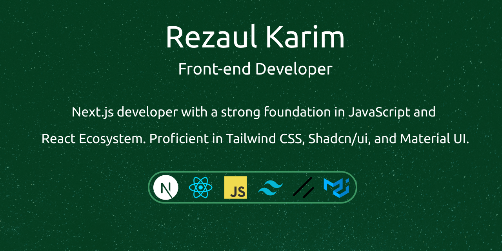

  
  

 
## Hey there 👋

I'm Rezaul Karim, a Front-end developer with a passion for building websites using React.js and Next.js. My journey in web development began in 2020, and since then, I've been sharpening my skills by learning new technologies and building websites for clients worldwide. I have built 60+ websites as a freelance web developer on Fiverr. I am known for creating reusable components and writing clean, organized
code, ensuring ease of maintenance for future updates by any developer. 

## ⚔️ Skills & Expertise
 

  

 
