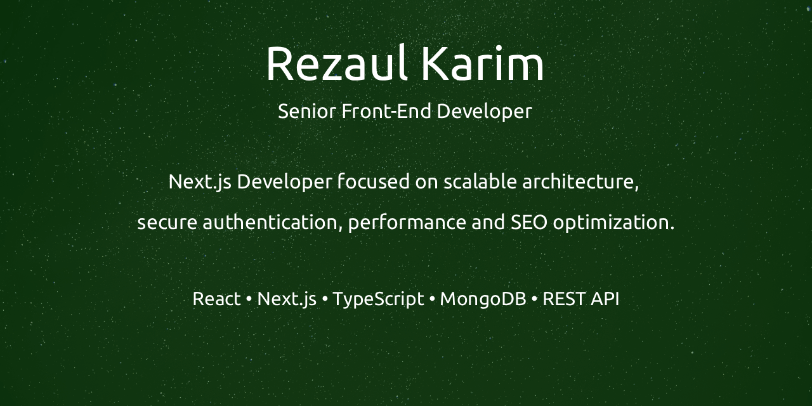

  
  

# Hi, I’m Rezaul Karim 👋

Senior Front-End Developer with **6+ years of professional experience** building **scalable, high-performance web applications**. I specialize in **React.js, Next.js, and TypeScript**, with a strong focus on **frontend architecture, performance, security, and maintainability**.

## 🧠 What I Work On
- Building modern web applications with **React, Next.js, and TypeScript**
- Implementing **secure authentication & authorization** (JWT, cookie-based sessions, NextAuth)
- Integrating **REST APIs** and handling complex client-side data flows
- Optimizing applications for **performance, SEO, and accessibility**
- Convert **Figma designs into pixel-perfect, responsive UIs**
- Collaborating with backend engineers, designers.

## 🤖 AI & Modern Web
- Integrating **AI-powered features** into web applications
- Building chat-based interfaces and tools using **Retrieval-Augmented Generation (RAG)**
- Improving UX through intelligent automation and data-driven workflows

## 🛠 Skills
**Languages & Core**
- JavaScript (ES6+), TypeScript, HTML5, CSS3

**Frontend**
- React.js, Next.js, Redux, Zustand
- Tailwind CSS, shadcn/ui
- React Hook Form, Zod

**Auth & APIs**
- JWT (cookie/session-based)
- NextAuth
- RESTful APIs

**Backend & Data (Working Knowledge)**
- Node.js, Express.js
- MongoDB, Mongoose, Prisma

**Testing & Tooling**
- Git & GitHub
- CI/CD workflows
- Vitest (familiar)
- Axios, Postman

**Animation & UI**
- Framer Motion
- GSAP (familiar)

## 👥 Leadership & Collaboration
- Led front-end teams and owned architectural decisions
- Conducted code reviews and enforced best practices
- Mentored developers on React & Next.js
- Worked closely with designers and backend teams in cross-functional environments
