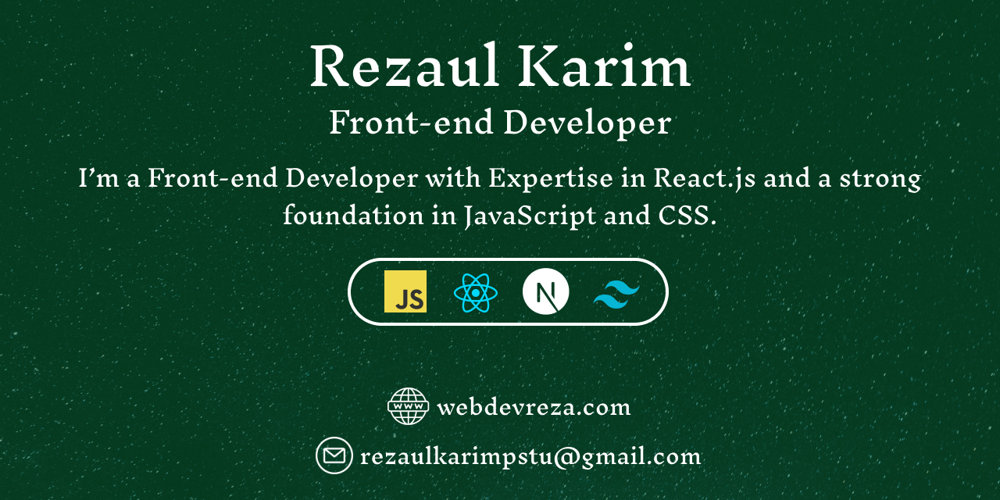

<h2 align="center">Hi there! I am Rezaul Karim 👋</h2>

   
  
  

 
## 👨‍💻 About me
<h3>I'm a Front-end developer with a passion for building websites using React.js. My journey in web development began in 2020, and since then, I've been sharpening my skills by learning new technologies and building websites for clients worldwide. I have built 60+ websites as a freelance web developer on Fiverr. I am ready to bring my enthusiasm and expertise to a dynamic team and contribute by delivering quality work.</h3>

## ⚔️ Skills & Expertise

 

 
