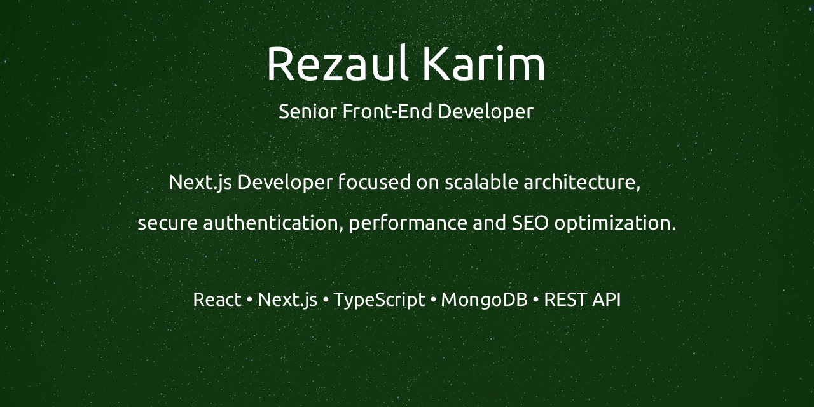

  
  

# Hi, I’m Rezaul Karim 👋

Frontend Developer with 4+ years of experience building modern, scalable web applications using React, Next.js, and TypeScript. Experienced in developing SaaS dashboards, authentication systems, and high-performance user interfaces for production environments. Proven track record of delivering client projects, collaborating with cross-functional teams, and working with US-based remote teams. Strong focus on clean architecture, performance optimization, and maintainable code.

## 🧠 What I Work On
- Building modern web applications with **React, Next.js, and TypeScript**
- Implementing **secure authentication & authorization** (JWT, cookie-based sessions, NextAuth)
- Integrating **REST APIs** and handling complex client-side data flows
- Optimizing applications for **performance, SEO, and accessibility**
- Convert **Figma designs into pixel-perfect, responsive UIs**
- Collaborating with backend engineers, designers.

## 🤖 AI & Modern Web
- Integrating **AI-powered features** into web applications
- Building chat-based interfaces and tools using **Retrieval-Augmented Generation (RAG)**
- Improving UX through intelligent automation and data-driven workflows

## 🛠 Skills
**Frontend**
- JavaScript, TypeScript, HTML, CSS
- React.js, Next.js, Redux, Zustand
- Tailwind CSS, shadcn/ui
- React Hook Form, Zod
- JWT (cookie/session-based)
- NextAuth
- RESTful APIs

**Backend**
- Node.js, Express.js
- MongoDB, Mongoose, Prisma

**Testing & Tooling**
- Git & GitHub
- CI/CD workflows
- Vitest (familiar)
- Axios, Postman

## 👥 Leadership & Collaboration
- Led front-end teams and owned architectural decisions
- Conducted code reviews and enforced best practices
- Mentored developers on React & Next.js
- Worked closely with designers and backend teams.
